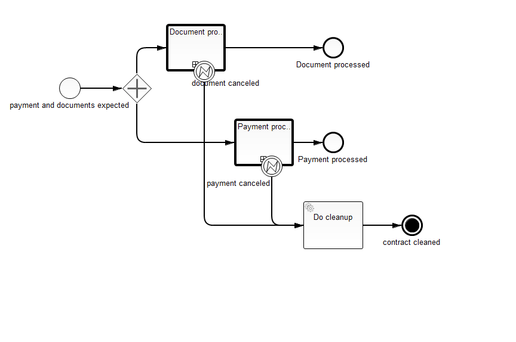
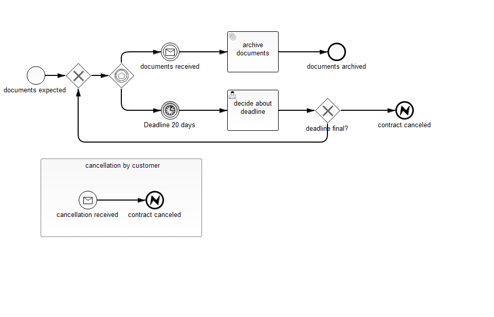

# Cancel a process instance from a sub process

This example shows how to cancel a process instance and clean up your domain data with BPMN.

Have a look at the JUnit test to get a first idea what's going on.

The main process `contract_handling` splits up into two parallel paths to wait for documents and payment. In each subprocess either the customer can cancel the contract or the company can cancel the contract, if the deadline for payment or documents is expired. But the company can extend the deadline for another period.

This project has been generated by the Maven archetype
[camunda-archetype-ejb-war-7.3.1](http://docs.camunda.org/latest/guides/user-guide/#process-applications-maven-project-templates-archetypes).

## Show me the important parts!
The super process:

The sub process:

## How does it work?

The cancellation either from the company or from the customer leads to an error end event which is catched as boundary event at the call activity.

The JUnit tests show how to use it with the Java API.

### Used BPMN constructs

* Call Activity for independent subprocesses
* Throwing error end event to use a separate exit from the subprocesses
* catching error boundary event to handle the separate exit
* event subprocess to react on the cancel event over the complete lifetime

## How to use it?
To get started refer to the `InMemoryH2Test`.

You can download a Camunda BPM distribution for JBoss from the
[Camunda BPM download page](http://camunda.org/download/).

To deploy the process application to your Camunda BPM Platform run `mvn clean deploy:jboss-as`. 

You can also use `ant` to build and deploy the example to an application server.
For that to work you need to copy the file `build.properties.example` to `build.properties`
and configure the path to your application server inside it.
Alternatively, you can also copy it to `${user.home}/.camunda/build.properties`
to have a central configuration that works with all projects generated by the
[Camunda BPM Maven Archetypes](http://docs.camunda.org/latest/guides/user-guide/#process-applications-maven-project-templates-archetypes).

Once you deployed the application you can run it using
[Camunda Tasklist](http://docs.camunda.org/latest/guides/user-guide/#tasklist)
and inspect it using
[Camunda Cockpit](http://docs.camunda.org/latest/guides/user-guide/#cockpit).

### Run through the process

Use the REST-API to send messages to the process instance. [Details of the message rest call](http://docs.camunda.org/7.3/api-references/rest/#message-deliver-a-message)

For example you can send this request:

    POST http://localhost:8080/camunda/api/engine/engine/default/message

with this payload

    {"messageName" : "payment_received",
    "correlationKeys" : { },
    "processVariables" : { }
    } 
    
to pay the contract. 

If you want to decide about the deadline manually without waiting 20 days, you can fire the timers now. Get the jobs and look for your timer-jobs.

    GET http://localhost:8080/camunda/api/engine/engine/default/job?processDefinitionKey=document_handling
copy the id to the clipboard and execute the job:

    POST http://localhost:8080/camunda/api/engine/engine/default/job/{aJobId}/execute

## Environment Restrictions
Built and tested against Camunda BPM Jboss version 7.3.0.

## License
[Apache License, Version 2.0](http://www.apache.org/licenses/LICENSE-2.0).

<!-- HTML snippet for index page
  <tr>
    <td></td>
    <td><a href="snippets/terminate-subprocesses">Camunda BPM Process Application</a></td>
    <td>A Process Application for [Camunda BPM](http://docs.camunda.org).</td>
  </tr>
-->