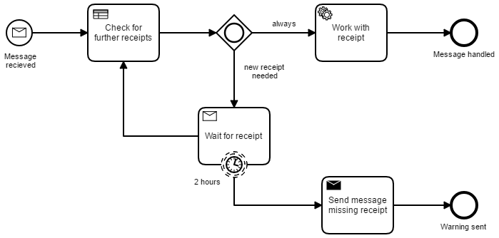

# Examine Message Correlation
A Process Application for [Camunda BPM](http://docs.camunda.org).

This application was built to examine the behavior of message correlation when a process receives the message either as start event or as receive task.

## Show me the important parts!

## How does it work?

Have a look in the [JUnit tests](src/test/java/com/camunda/consulting/correlate_message_question/nonarquillian/InMemoryH2Test.java) and read the two test methods.

With the help of `logBack-test.xml` you can inspect the SQL-statements in the commands in the console.

## How to use it?
There is no web interface to access the application.
To get started refer to the `InMemoryH2Test`.

Once you deployed the application you can run it using
[Camunda Tasklist](http://docs.camunda.org/latest/guides/user-guide/#tasklist)
and inspect it using
[Camunda Cockpit](http://docs.camunda.org/latest/guides/user-guide/#cockpit).

## License
[Apache License, Version 2.0](http://www.apache.org/licenses/LICENSE-2.0).

<!-- HTML snippet for index page
  <tr>
    <td></td>
    <td><a href="snippets/correlate-message-question">Camunda BPM Process Application</a></td>
    <td>A Process Application for [Camunda BPM](http://docs.camunda.org).</td>
  </tr>
-->
<!-- Tweet
New @CamundaBPM example: Camunda BPM Process Application - A Process Application for [Camunda BPM](http://docs.camunda.org). https://github.com/camunda/camunda-consulting/tree/master/snippets/correlate-message-question
-->