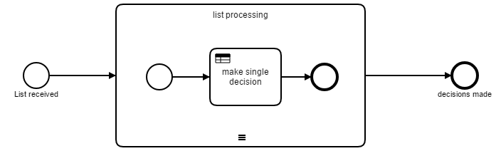

# Evaluate a list of values by a DMN Decision Table

This project shows how a list of values can be evaluated by a Decision Table. It uses a sequential multi instance subprocess to iterate through all values of the list. The decision result is added to the predefied result list in an output mapping.

This mapping is build as an inline JavaScript snippet:

    print("decisionResult: " + decisionResultBPMN);
    var scriptList = resultList;
    print("internal result List before: " + scriptList);
    scriptList.add(decisionResultBPMN);
    print("internal result List after: " + scriptList);
    scriptList;

This is the most easy way to fill the resultList. If you start to build the resultList in the script you have to convert the JavaScript array into a java.util.List 

This project has been generated by the Maven archetype
[camunda-archetype-ejb-war-7.4.0](http://docs.camunda.org/latest/guides/user-guide/#process-applications-maven-project-templates-archetypes).

## Show me the important parts!

## How does it work?

## How to use it?
There is no web interface to access the application.
To get started refer to the `InMemoryH2Test`.

## Environment Restrictions
Built and tested against Camunda BPM version 7.4.0.

## License
[Apache License, Version 2.0](http://www.apache.org/licenses/LICENSE-2.0).

<!-- HTML snippet for index page
  <tr>
    <td></td>
    <td><a href="snippets/decision-resultlist">Camunda BPM Process Application</a></td>
    <td>A Process Application for [Camunda BPM](http://docs.camunda.org).</td>
  </tr>
-->