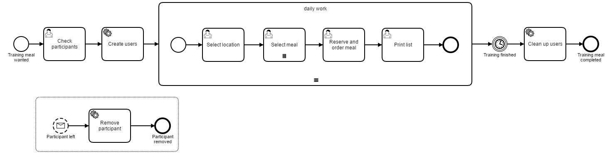

# Meal Order Process
A Process Application for [Camunda BPM](http://docs.camunda.org).

This project has been generated by the Maven archetype
[camunda-archetype-servlet-war-7.5.0](http://docs.camunda.org/latest/guides/user-guide/#process-applications-maven-project-templates-archetypes).

## Show me the important parts!

## How to use it?
Start page is [create-training.html](http://localhost:8080/meal-ordering-process/create-training.html).

To get started refer to the `InMemoryH2Test`.

Deploy with
`mvn clean tomcat7:[re|un|]deploy`

Once you deployed the application you can run it using
[Camunda Tasklist](http://docs.camunda.org/latest/guides/user-guide/#tasklist)
and inspect it using
[Camunda Cockpit](http://docs.camunda.org/latest/guides/user-guide/#cockpit).

## Environment Restrictions
Built and tested against Camunda BPM version 7.5.0.

## Known Limitations
- Sometimes Optimistic Locking exceptions while completing multi instance tasks  

## Improvements Backlog
- Feed the trainer, too
- Add and remove partcipants in start-and edit form
- load menues dynamically
  ([http://mokkabar.net/restaurant/](http://mokkabar.net/restaurant/), 
  [http://www.matzbach-berlin.de/pdf/Speisekarte_deutsch_.pdf](http://www.matzbach-berlin.de/pdf/Speisekarte_deutsch_.pdf), 
  [http://senviet.de/](http://senviet.de/))
- Add popup to print the list
- Select start- and endtime
- Add authorization to start- and remove-participant page

## License
[Apache License, Version 2.0](http://www.apache.org/licenses/LICENSE-2.0).

<!-- HTML snippet for index page
  <tr>
    <td></td>
    <td><a href="snippets/meal-ordering-process">Camunda BPM Process Application</a></td>
    <td>A Process Application for [Camunda BPM](http://docs.camunda.org).</td>
  </tr>
-->
<!-- Tweet
New @CamundaBPM example: Camunda BPM Process Application - A Process Application for [Camunda BPM](http://docs.camunda.org). https://github.com/camunda/camunda-consulting/tree/master/snippets/meal-ordering-process
-->