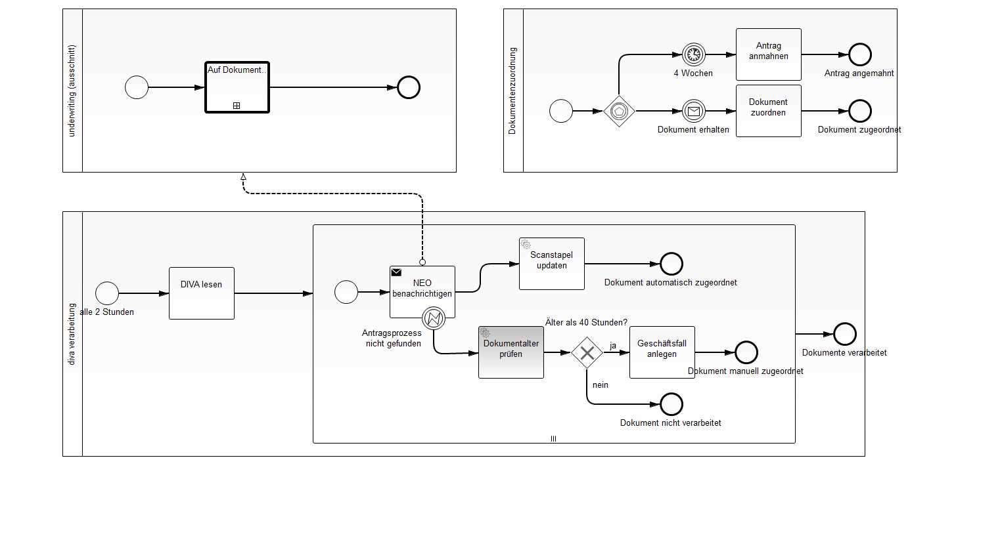

Use a call activity to receive messages
=========================

This project has been generated by the Maven archetype
[camunda-archetype-ejb-war-7.2.1](http://docs.camunda.org/latest/guides/user-guide/#process-applications-maven-project-templates-archetypes).

Show me the important parts!
----------------------------

This is an example to show the correlation of documents received on paper and scanned afterwards to running approval process instances.

The message flow cannot connect to a call activity, it has to point to pool.

How does it work?
-----------------

The implementation of the send task:

    public void execute(DelegateExecution execution) throws Exception {
      String documentId = (String) execution.getVariable("document");
      Map<String, Object> correlationKeys = new HashMap<String, Object>();
      correlationKeys.put("antragId", documentId);
      try {
        execution.getProcessEngineServices().getRuntimeService().correlateMessage("dokument_erhalten", correlationKeys);
      } catch (MismatchingMessageCorrelationException e) {
        log.severe(e.getMessage());
        throw new BpmnError("antrag_nicht_gefunden");
      }
    }

The rest is plain BPMN 2.0.

How to use it?
--------------

Make the non start event of NEO-DIVA_lesen to a timer start event with cycle of 2 hours:

    <bpmn:timerEventDefinition id="_TimerEventDefinition_2">
      <bpmn:timeCycle xsi:type="bpmn:tFormalExpression">PT2H</bpmn:timeCycle>
    </bpmn:timerEventDefinition>

and deploy it to a running process engine.

and have a look at the jUnit-tests to see, what variables are expected.

There is no web interface to access the application.
To get started refer to the `InMemoryH2Test`.

You can also use `ant` to build and deploy the example to an application server.
For that to work you need to copy the file `build.properties.example` to `build.properties`
and configure the path to your application server inside it.
Alternatively, you can also copy it to `${user.home}/.camunda/build.properties`
to have a central configuration that works with all projects generated by the
[Camunda BPM Maven Archetypes](http://docs.camunda.org/latest/guides/user-guide/#process-applications-maven-project-templates-archetypes).

Once you deployed the application you can run it using
[Camunda Tasklist](http://docs.camunda.org/latest/guides/user-guide/#tasklist)
and inspect it using
[Camunda Cockpit](http://docs.camunda.org/latest/guides/user-guide/#cockpit).

Environment Restrictions
------------------------

Built and tested against Camunda BPM version 7.2.0.

License
-------

[Apache License, Version 2.0](http://www.apache.org/licenses/LICENSE-2.0).
