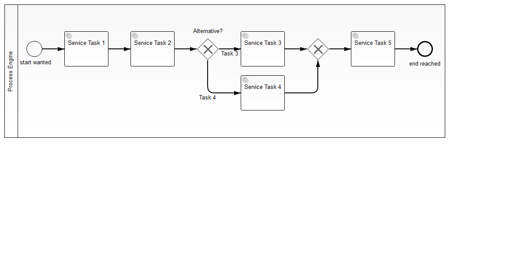
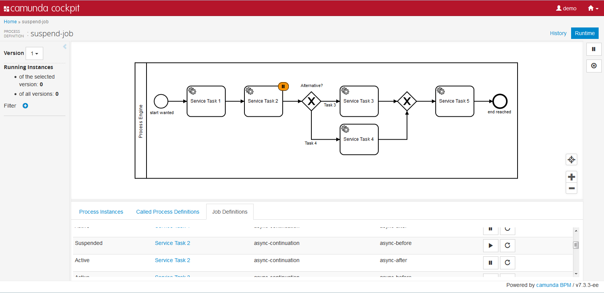

# Suspend Jobs

This example shows how to suspend jobs with the Java API. In the process definition each service task is marked as async-before and async-after to get a huge amount of job definitions.
   
## Show me the important parts!

Read the [JUnit test](src/test/java/com/camunda/consulting/suspendJob/nonarquillian/InMemoryH2Test.java) to get an idea how you can handle job suspension in your own code. The comments guide you through the story. 

A Process Application for [Camunda BPM](http://docs.camunda.org).

This project has been generated by the Maven archetype
[camunda-archetype-ejb-war-7.3.2](http://docs.camunda.org/latest/guides/user-guide/#process-applications-maven-project-templates-archetypes).

## How to use it?

You can deploy the process application to the Camunda BPM Platform running on jboss or wildfly server and start process instances from the task list. 

If you suspend some job definitions in the cockpit before, the process instance will wait at these service tasks until the jobs get activated again.

The most easy way to deploy it to a local server is `mvn clean wildfly:deploy`.
 
You can also use `ant` to build and deploy the example to an application server.
For that to work you need to copy the file `build.properties.example` to `build.properties`
and configure the path to your application server inside it.
Alternatively, you can also copy it to `${user.home}/.camunda/build.properties`
to have a central configuration that works with all projects generated by the
[Camunda BPM Maven Archetypes](http://docs.camunda.org/latest/guides/user-guide/#process-applications-maven-project-templates-archetypes).

Once you deployed the application you can run it using
[Camunda Tasklist](http://docs.camunda.org/latest/guides/user-guide/#tasklist)
and inspect it using
[Camunda Cockpit](http://docs.camunda.org/latest/guides/user-guide/#cockpit).

## Environment Restrictions
Built and tested against Camunda BPM version 7.3.0.

## License
[Apache License, Version 2.0](http://www.apache.org/licenses/LICENSE-2.0).

<!-- HTML snippet for index page
  <tr>
    <td></td>
    <td><a href="snippets/supend-job">Camunda BPM Process Application</a></td>
    <td>A Process Application for [Camunda BPM](http://docs.camunda.org).</td>
  </tr>
-->