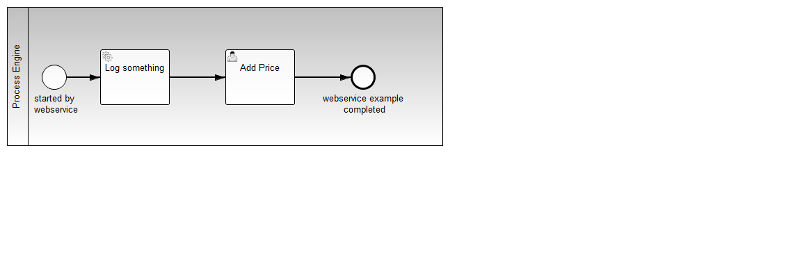
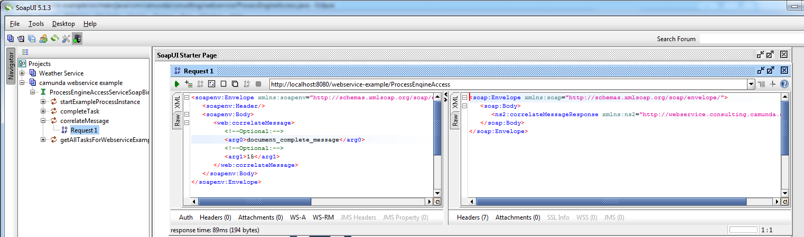

webservice-example
=========================

A short example how a JEE webservice build by annotations can interact with a process engine to start process instances, complete tasks and correlate messages.

It's more an example to show the webservice implementation than the process applicaton.

After deploying this to Wildfly/JBoss you can get des WSDL from the url [http://localhost:8080/webservice-example/ProcessEngineAccess?WDSL](http://localhost:8080/webservice-example/ProcessEngineAccess?WDSL)

If you import this WSDL in a SoapUi-project, you can play around with it and call the services manually.
 
This project has been generated by the Maven archetype
[camunda-archetype-ejb-war-7.2.1](http://docs.camunda.org/latest/guides/user-guide/#process-applications-maven-project-templates-archetypes).

Show me the important parts!
----------------------------

How does it work?
-----------------

Have a look at the [ProcessEngineAccess](src/main/java/com/camunda/consulting/webservice/ProcessEngineAccess.java) class. 

The correlateMessage() uses the first parameter as message and the second parameter as correlation key to find the task to complete.  

How to use it?
--------------

After importing the WSDL into SoapUi it will look like this

Here you can send the message manually.

There is no web interface to access the application.
To get started refer to the `InMemoryH2Test`.

Deploy the project with maven: `mvn clean wildfly:deploy`

You can also use `ant` to build and deploy the example to an application server.
For that to work you need to copy the file `build.properties.example` to `build.properties`
and configure the path to your application server inside it.
Alternatively, you can also copy it to `${user.home}/.camunda/build.properties`
to have a central configuration that works with all projects generated by the
[Camunda BPM Maven Archetypes](http://docs.camunda.org/latest/guides/user-guide/#process-applications-maven-project-templates-archetypes).

Once you deployed the application you can run it using
[Camunda Tasklist](http://docs.camunda.org/latest/guides/user-guide/#tasklist)
and inspect it using
[Camunda Cockpit](http://docs.camunda.org/latest/guides/user-guide/#cockpit).

Environment Restrictions
------------------------

Built and tested against Camunda BPM version 7.3.0.

Known Limitations
-----------------

Improvements Backlog
--------------------

License
-------

[Apache License, Version 2.0](http://www.apache.org/licenses/LICENSE-2.0).
